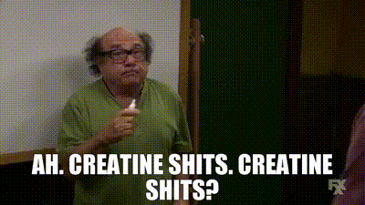
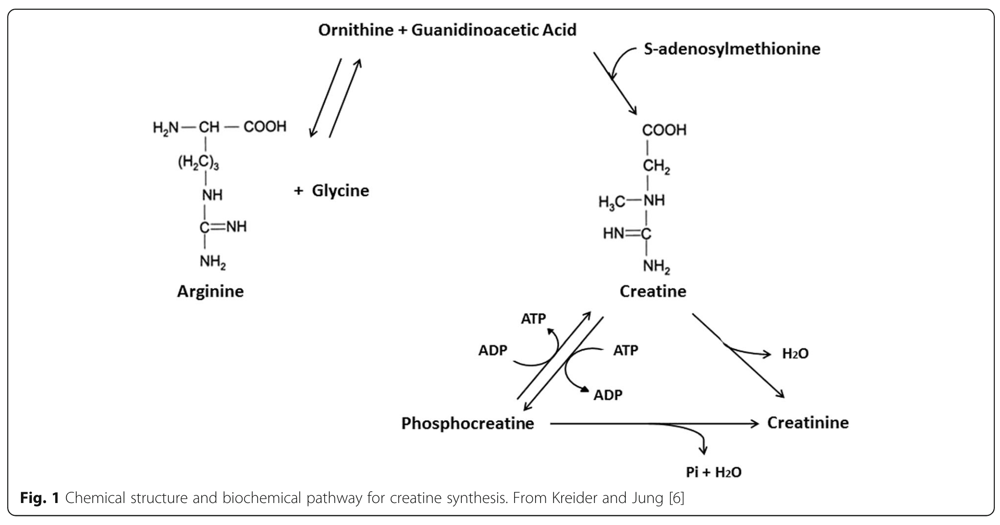

Hey, meatsuits. I'm of the opinion that most people stand to benefit from supplementing creatine. I'll try to lay out my argument for why. I'm not the first or the only to [make this argument](https://www.sciencedirect.com/science/article/pii/S1756464621002176), nor do I have any illusions that I will do it more rigorously, or convincingly. I have just seen benefits from it myself, and wanted to review the evidence and the mechanisms.

I think that it stands high, if not at the top, of the list of actually useful supplements - an example of a supplement that does not just result in expensive urine.

If you're an athlete, the benefits are significant in many respects. Better performance, more efficient workouts, faster recovery. See below for details.

If you are not an athlete: you still exercise, right? If you don't, then you are missing out on the most effective way to live healthier, longer, feel better and more capable, improve your mood, and many other benefits. I'll try to make this case in other writings.

In other words, everybody should be exercising, and would then benefit from these aspects of creatine supplementation. Is that not enough? How about improved memory, reasoning, and resistance to the effects of stress and sleep deprivation? Possible benefits against ischemic/hypoxic events, and oxidative stress?

All for one of the lowest costs, and with the longest track record of safety, of almost any supplement.

---

#### Creatine Benefits

- improved power/strength (5-15%), or up to 25% in the untrained [^Wax2021]
- increased time to exhaustion during high intensity endurance activity [^Forbes2023].
- more lean mass in response to resistance training [^Delpino2022] [^Forbes2021]
- lower body fat [^Dinan2022]
- improves short term memory and intelligence/reasoning in healthy individuals, with potential benefit in the aging/stressed/sleep deprived [^Avgerinos2018] [^Sandkuhler2023] [^Prokopidis2023].
- possible benefits to a host of neurologic conditions and difficult to treat conditions like post-COVID fatigue, fibromyalgia [^Slankamenac2023].
- may increase tolerance to hypoxic/ischemic events like childbirth, heart attacks, and strokes [^Balestrino2016], mood disorders [^Candow2023], concussions [^Candow2023]
- relatively low cost for magnitude of benefit - one of the best "bang for your buck" supplements at around $0.31 per daily dose by my calculation at time of writing

---

#### Creatine Adverse Effects

Possible side effects include:

- slight weight gain as a result of fluid retention
- 

Just kidding - creatine shits not a common side effect. Creatine is extremely safe, well tolerated in even large doses.

There are situations where there is limited research on safety like in renal disease. Everyone should check with their doctor to discuss their personal health situation - this blog is not medical advice and everybody's situation is unique.

---

## What is creatine?

- an amino acid derivative, synthesized from **arginine**, **glycine** and **methionine**. So we make it from protein, but it is not a protein itself.

It is produced in the liver and kidneys, and because we can produce it, around 1-2 grams a day, it is not “essential” in our diet. However, supplementing has some significant benefits, and the general population are probably not getting enough in the diet - almost 50% short of expected intake in the US [^Ostojic2021]. Some chronic conditions like liver disease, autism spectrum disorders, multiple sclerosis can also result in lower creatine reserves [^Ostojic2021].

The biggest source in our diet is meat. A pound of uncooked beef or salmon contains about 1-2g of creatine [^Kreider2017]. Most of us are not eating a pound of meat or fish per day.

Vegetarians, not surprisingly, generally have lower intramuscular creatine stores and *may* benefit more from supplementation.

What is its purpose in the body?

- When cells have a surplus of creatine and ATP (cellular energy source), ATP can donate a phosphate group to form phosphocreatine.  Phosphocreatine acts as an "energy buffer" to regenerate lost ATP. Supplementing creatine can saturate cells with creatine and phosphocreatine, maximizing the ability to regenerate energy for intense activity.

## Dosing

So, if we are not getting enough or making enough, how much extra should we take?

Supplementation amount:

- common recommendations are for 3g in non-athletic adults, elderly, 5-10g for athletes
- some use a "loading phase" when first starting to take it, 5-10g 2-4 times per day for around a week

Supplementation can increase serum creatine concentration almost ten fold [^Kalhan2016], with intramuscular total creatine content increasing up to 50% (20-40% as phosphocreatine) [^Wax2021].

What type of creatine to supplement?

- Creatine monohydrate. There are many other forms but no significant benefit.

Taking it with carbs and/or protein may be more effective.

There is a possible slight benefit to consuming post-exercise, but the magnitude and mechanism aren't clear [^Ribeiro2021]. Speculated mechanisms include increased blood flow and nutrient transport triggered by exercise increasing delivery of creatine to muscles.

1-2% per day of the body's creatine stores are broken down daily and peed out in urine. Once levels are elevated, it takes about 4-6 weeks for creatine stores to return to baseline [^Kreider2017].

## Benefits

The list of benefits to strength, work capacity, sport performance, and recovery are listed above. I would like to talk about *why* creatine results in these effects, and list a few more niche, less studied benefits that have been found as a result of creatine supplementation.

Creatine exerts its effects through its ability to combine with phosphate groups from ATP at times of rest to form *phosphocreatine*. Supplementation increases the amount of intramuscular *phosphocreatine* 20-40% [^Wax2021]. Phosphocreatine provides energy storage, and results in faster and more sustained ATP re-synthesis during times of stress.

Through the energy buffering / ATP re-synthesis, creatine supplementation allows increased work capacity, and as a result of *doing more work*, the benefits of exercise increase (lean mass gains, fat loss).

Creatine also decreases post-exercise inflammatory response, reduces markers of muscle damage after exercise, and restores damaged muscle's capacity to produce force .

Other less studied, possible benefits (thus far with limited evidence) in many more conditions:

- Post-COVID fatigue [^Slankamenac2023]
- Chronic fatigue syndrome [^Ostojic2021]
- Neurodegenerative conditions [^Candow2023]
- Fibromyalgia [^Alves2013]
- Brain and heart ischemia (strokes and heart attacks) [^Balestrino2016]
- Pregnancy and ischemia during delivery [^Dickinson2014]
- Mood disorders [^Candow2023]
- Concussions [^Candow2023]

It is less easy to study the effects of supplementation directly on the brain because fewer researchers are doing brain than muscle biopsies. But, it stands to reason that it is the same process, the ATP buffering/re-synthesis, that could allow for improvements in memory/recall/reasoning, especially in times of stress. For the brain, that is intense cognitive load, sleep deprivation, ischemic events, or disease conditions.

## Safety

What is interesting to me about all of these clinical studies, as well, is that there have not been any significant adverse effects from supplementing creatine.

No supplement can be considered perfectly safe, so there may be something found down the road with long term clinical studies. But, so far I think the evidence is reassuring that the supplement is safe in the short to medium term for most people.

Unknowns start to be introduced with potential contaminants introduced in the manufacturing process, so there should be special caution about selecting the right manufacturer and whether the risks outweigh the benefits in certain populations, like children.

---

### Creatine in a Pediatric Population

Can children take it safely?

- Probably, but it is not recommended by the American Academy of Pediatrics [^Metzl2001]. Note that the AAP recommendations have not been updated since 2001, with a plethora of creatine research on safety and efficacy done in the last 20 years.
- From my perspective, the biggest concern is not the creatine itself, if from a reliable source, but the potential additives or contaminants (like lead, mercury, dicyandiamide, dihydrotriazine) in unregulated supplements and their effect on a developing body. In a 2011 study by Moret et al, 50% of analyzed creatine supplements exceeded the maximum recommended levels of at least one contaminant [^Moret2011].

---

### Creatine and Kidney Function

There were initial concerns about the detrimental effects of creatine supplementation on kidney function, because creatine breaks down into creatinine, which is a commonly used measure of renal function. If creatinine goes up, kidney function must be worse? Well, not really [^Longobardi2023]. That was based on case reports and has not held up.

The one caveat to the above is that there is limited data on creatine use in the setting of existing renal dysfunction. There may be a pathway by which creatinine is broken down into other substances when concentration is high, that would not be a concern with healthy kidneys. It has not been studied, and so caution is warranted [^Longobardi2023].

---

### Creatine and Weight Gain

How much weight gain? About 0.5-1.0L of fluid retention is typical, so about the same in kilograms [^Kreider2017].

- 95% of creatine is stored in muscles. Supplementation increases stored creatine, which has an osmotic effect. For those who have not taken chemistry or slept through that day of chemistry, water moves into areas that have more solute, AKA “other stuff dissolved in water". In this case, we are adding more stuff, the creatine, that pulls more water into muscles. They get bigger, and the body gains "water weight". Similar concept to when you eat a lot of carbs as carbohydrates are also brought into cells and bring some water along with them.

I know there is a lot of stigma about weight gain, but there are a few reasons why this is probably not as big of a deal as you think it is.

- 1. Creatine does not increase fat mass [^Antonio2021]. It's not adipose tissue that then has to be lost with a caloric deficit. It will go away when/if you stop supplementing creatine.
- 2. Muscles looking bigger tends to be more aesthetically pleasing than other kinds of weight gain. You "carry it" differently.
- 3. The water retention will cap when your cells are saturated with creatine. Unlike fat gain, there is an upper bound.

The fluid retention is not seen in everyone, and it is a minor increase compared to total body water and your baseline weight. But, you'll have to decide if the possibility is significant or the effect adverse.

---

Are we at higher risk for muscle injury? Dehydration? Muscle cramping?

- No to all of the above. In fact, studies have demonstrated less incidence of cramping, heat illness, dehydration, muscle strain, total injuries, and missed practices in those taking creatine [^Kreider2017].

---

What about hair loss? There was that one study that showed increased DHT, right?

- One study showed an increase in DHT in rugby players given creatine [^vanderMerwe2009]. This result has not been replicated and there are many factors, including exercise, that may contribute to DHT fluctuations. In other studies, creatine has not been shown to affect testosterone (free or total), or DHT [^Antonio2021].

---

I have seen anecdotal accounts of insomnia resulting from creatine supplementation. This is not implausible at its face, due to the interactions with adenosine compounds. I am unable to find any studies looking at this outcome.

---

## Legality

Is it banned in any sports?

- No. There was controversy in the 1990s but it is not feasible to ban supplementation because it is found in meat and produced by multiple cell types in our bodies.

## Personal Experience and Wrapping Up

So, bottom line: should you take it?

Well, this blog is not medical advice. Keep in mind that long term data (more than 5 years) on the effects of supplementation are lacking, and creatine is not studied fully in many medical conditions, including renal disease. There may be an alternate pathway the body uses to metabolize creatine when it cannot excrete it, as in advanced renal disease, that could potentially result in harm.

I consider myself an amateur or hobbyist exerciser, not elite in any sport. I already took creatine even before this deep dive. Anecdotally, I notice a difference when I take it. I feel stronger and more capable in my workouts. I do feel like there is a little bit more "bulk" to my muscles, I suspect from a little bit of water retention, but it is nothing that anybody else likely notices or has commented on. I can say that I will continue to take it, and even more confidently after the research I've done here.

I can't speak to memory benefits. If they exist, for me they are subtle. There may not be enough clay to sculpt, there. One thing I do notice, because I work night shifts, is some slight resistance to mental fatigue toward the end of a 12 hour shift on a string of nights. Anecdotal, but it fits with some studies on the benefits of creatine in cognition and sleep deprivation.

Check out the linked papers if you want more information.

## Brand and Formulation Recommendation

Any recommended brands or formulations?

- I personally take [Optimum Nutrition micronized creatine monohydrate](https://a.co/d/5Ixu1bk) (no affiliate link / not sponsored). There is also a [capsule form](https://a.co/d/fihJ455) that will be more expensive per serving but may be more tolerable. The powder is a little gritty but has minimal flavor and is easily swallowed in just a couple of ounces of water.

## References

[^Antonio2021]: Antonio, J. *et al.* (2021) ‘Common questions and misconceptions about creatine supplementation: what does the scientific evidence really show?’, *Journal of the International Society of Sports Nutrition*, 18, p. 13. Available at: [https://doi.org/10.1186/s12970-021-00412-w](https://doi.org/10.1186/s12970-021-00412-w).

[^Balestrino2016]: Balestrino, M. *et al.* (2016) ‘Potential of creatine or phosphocreatine supplementation in cerebrovascular disease and in ischemic heart disease’, *Amino Acids*, 48(8), pp. 1955–1967. Available at: [https://doi.org/10.1007/s00726-016-2173-8](https://doi.org/10.1007/s00726-016-2173-8).

[^Longobardi2023]: Longobardi, I. et al. (2023) ‘Is It Time for a Requiem for Creatine Supplementation-Induced Kidney Failure? A Narrative Review’, Nutrients, 15(6), p. 1466. Available at: <https://doi.org/10.3390/nu15061466>.

[^Candow2023]: Candow, D.G. *et al.* (2023) ‘“Heads Up” for Creatine Supplementation and its Potential Applications for Brain Health and Function’, *Sports Medicine*, 53(1), pp. 49–65. Available at: [https://doi.org/10.1007/s40279-023-01870-9](https://doi.org/10.1007/s40279-023-01870-9).

[^Kreider2017]: Kreider, R.B. *et al.* (2017) ‘International Society of Sports Nutrition position stand: safety and efficacy of creatine supplementation in exercise, sport, and medicine’, *Journal of the International Society of Sports Nutrition*, 14, p. 18. Available at: [https://doi.org/10.1186/s12970-017-0173-z](https://doi.org/10.1186/s12970-017-0173-z).

[^Prokopidis2023]: Prokopidis, K. *et al.* (2023) ‘Effects of creatine supplementation on memory in healthy individuals: a systematic review and meta-analysis of randomized controlled trials’, *Nutrition Reviews*, 81(4), pp. 416–427. Available at: [https://doi.org/10.1093/nutrit/nuac064](https://doi.org/10.1093/nutrit/nuac064).

[^Kalhan2016]: Kalhan, S.C. et al. (2016) ‘Whole Body Creatine and Protein Kinetics in Healthy Men and Women: Effects of creatine and amino acid supplementation’, Amino acids, 48(3), pp. 677–687. Available at: <https://doi.org/10.1007/s00726-015-2111-1>.

[^Forbes2023]: Forbes, S.C. et al. (2023) ‘Creatine supplementation and endurance performance: surges and sprints to win the race’, Journal of the International Society of Sports Nutrition, 20(1), p. 2204071. Available at: <https://doi.org/10.1080/15502783.2023.2204071>.

[^Avgerinos2018]: Avgerinos, K.I. et al. (2018) ‘Effects of creatine supplementation on cognitive function of healthy individuals: A systematic review of randomized controlled trials’, Experimental gerontology, 108, pp. 166–173. Available at: <https://doi.org/10.1016/j.exger.2018.04.013>.

[^Sandkuhler2023]: Sandkühler, J.F. et al. (2023) ‘The effects of creatine supplementation on cognitive performance—a randomised controlled study’, BMC Medicine, 21(1), pp. 1–16. Available at: <https://doi.org/10.1186/s12916-023-03146-5>.

[^Slankamenac2023]: Slankamenac, J. et al. (2023) ‘Effects of six-month creatine supplementation on patient- and clinician-reported outcomes, and tissue creatine levels in patients with post-COVID-19 fatigue syndrome’, Food Science & Nutrition, 11(11), pp. 6899–6906. Available at: <https://doi.org/10.1002/fsn3.3597>.

[^Alves2013]: Alves, C.R.R. et al. (2013) ‘Creatine supplementation in fibromyalgia: a randomized, double-blind, placebo-controlled trial’, Arthritis Care & Research, 65(9), pp. 1449–1459. Available at: <https://doi.org/10.1002/acr.22020>.

[^Ostojic2021]: Ostojic, S.M. (2021) ‘Creatine as a food supplement for the general population’, Journal of Functional Foods, 83, p. 104568. Available at: <https://doi.org/10.1016/j.jff.2021.104568>.

[^Dickinson2014]: Dickinson, H. et al. (2014) ‘Creatine supplementation during pregnancy: summary of experimental studies suggesting a treatment to improve fetal and neonatal morbidity and reduce mortality in high-risk human pregnancy’, BMC Pregnancy and Childbirth, 14(1), p. 150. Available at: <https://doi.org/10.1186/1471-2393-14-150>.

[^Delpino2022]: Delpino, F.M. et al. (2022) ‘Influence of age, sex, and type of exercise on the efficacy of creatine supplementation on lean body mass: A systematic review and meta-analysis of randomized clinical trials’, Nutrition (Burbank, Los Angeles County, Calif.), 103–104, p. 111791. Available at: <https://doi.org/10.1016/j.nut.2022.111791>.

[^Forbes2021]: Forbes, S.C. et al. (2021) ‘Meta-Analysis Examining the Importance of Creatine Ingestion Strategies on Lean Tissue Mass and Strength in Older Adults’, Nutrients, 13(6), p. 1912. Available at: <https://doi.org/10.3390/nu13061912>.

[^Dinan2022]: Dinan, N.E. et al. (2022) ‘Effects of creatine monohydrate timing on resistance training adaptations and body composition after 8 weeks in male and female collegiate athletes’, Frontiers in Sports and Active Living, 4. Available at: <https://doi.org/10.3389/fspor.2022.1033842>.

[^Wax2021]: Wax, B. et al. (2021) ‘Creatine for Exercise and Sports Performance, with Recovery Considerations for Healthy Populations’, Nutrients, 13(6), p. 1915. Available at: <https://doi.org/10.3390/nu13061915>.

[^Moret2011]: Moret, S., Prevarin, A. and Tubaro, F. (2011) ‘Levels of creatine, organic contaminants and heavy metals in creatine dietary supplements’, Food Chemistry, 126(3), pp. 1232–1238. Available at: <https://doi.org/10.1016/j.foodchem.2010.12.028>.

[^Metzl2001]: Metzl, J.D. et al. (2001) ‘Creatine Use Among Young Athletes’, Pediatrics, 108(2), pp. 421–425. Available at: <https://doi.org/10.1542/peds.108.2.421>.

[^Ribeiro2021]: Ribeiro, F. et al. (2021) ‘Timing of Creatine Supplementation around Exercise: A Real Concern?’, Nutrients, 13(8), p. 2844. Available at: <https://doi.org/10.3390/nu13082844>.
