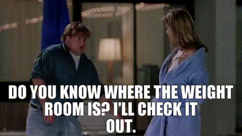

Hey, meatsuits. Most people should be taking creatine. Why? I think a better question is *why not*, but let's give it a try.

<table class="table">
<thead></thead>
<tbody>
        <tr>
            <td>
- improved power/strength (5-15%), work capacity, recovery
        </td>
<td>
- more lean mass gains

- cognitive benefits

  - sleep deprivation tolerance

  - possible recall improvements in certain populations

- possible benefits to a host of neurologic conditions and difficult to treat conditions like post-COVID fatigue, fibromyalgia

- relatively low cost for magnitude of benefit - one of the best "bang for your buck" supplements at around $0.31 per daily dose by my calculation at time of writing
                </td>
            </tr>

</tbody>
</table>

Sound too good to be true? Here's the downsides:

Creatine is extremely safe, well tolerated in even large doses.

There are exceptions where there is no research on its safety like in advanced renal disease. Everyone should check with their doctor to discuss their health situations.

  

    <h2 class="accordion-header">
      <button class="accordion-button" type="button" data-bs-toggle="collapse" data-bs-target="#panelsStayOpen-collapseOne" aria-expanded="true" aria-controls="panelsStayOpen-collapseOne">
        Creatine - Proven Benefits
      </button>
    </h2>
    

      

      

    

  

  

    <h2 class="accordion-header">
      <button class="accordion-button collapsed" type="button" data-bs-toggle="collapse" data-bs-target="#panelsStayOpen-collapseTwo" aria-expanded="false" aria-controls="panelsStayOpen-collapseTwo">
        Creatine - Ongoing Research
      </button>
    </h2>
    

      

        <strong>This is the second item's accordion body.</strong> It is hidden by default, until the collapse plugin adds the appropriate classes that we use to style each element. These classes control the overall appearance, as well as the showing and hiding via CSS transitions. You can modify any of this with custom CSS or overriding our default variables. It's also worth noting that just about any HTML can go within the <code>.accordion-body</code>, though the transition does limit overflow.
      

    

  

  

    <h2 class="accordion-header">
      <button class="accordion-button collapsed" type="button" data-bs-toggle="collapse" data-bs-target="#panelsStayOpen-collapseThree" aria-expanded="false" aria-controls="panelsStayOpen-collapseThree">
        Creatine - Adverse Effects
      </button>
    </h2>
    

      

    

  

  

    <h2 class="accordion-header">
      <button class="accordion-button collapsed" type="button" data-bs-toggle="collapse" data-bs-target="#panelsStayOpen-collapseFour" aria-expanded="false" aria-controls="panelsStayOpen-collapseFour">
        Creatine - Dosing
      </button>
    </h2>
    

      

        <strong>This is the third item's accordion body.</strong> It is hidden by default, until the collapse plugin adds the appropriate classes that we use to style each element. These classes control the overall appearance, as well as the showing and hiding via CSS transitions. You can modify any of this with custom CSS or overriding our default variables. It's also worth noting that just about any HTML can go within the <code>.accordion-body</code>, though the transition does limit overflow.
      

    

  

 

Just kidding. If you experience this, you are probably taking too much.

Let's get into the details, for those that are interested.
You interested in creatine? I think you should be. It is one of the most studied, most scrutinized, most effective supplements of all time.

Does it work? Will it mess up your kidneys? Let's take a look at the evidence.

## What is creatine?

- an amino acid derivative, synthesized from **arginine**, **glycine** and **methionine**. So we make it from protein, but it is not a protein itself.

What is its purpose in the body?

- Cells use it to sort of "store" energy for activities, like muscle contractions and thinking.

It is produced in the liver and kidneys, and because we can produce it, around 1-2 grams a day, it is not “essential” in our diet. However, supplementing has some significant benefits, as you will see, especially if your intake in food is low.

The biggest source in our diet is meat. A pound of uncooked beef or salmon contains about 1-2g of creatine (Kreider 2017). Most of us are not eating a pound of meat or fish per day.

Vegetarians, not surprisingly, generally have lower intramuscular creatine stores and may benefit more from supplementation.

## Dosing

So, if we are not getting enough or making enough, how much extra should we take?

Supplementation amount:

- common recommendations are for 3g in non-athletic adults, elderly, 5-10g for athletes
- some use a "loading phase" when first starting to take it, 5-10g 2-4 times per day for around a week

Supplementation can increase serum creatine concentration almost ten fold.

What type of creatine to supplement?

- Creatine monohydrate. There are many other forms but no significant benefit.

Taking it with carbs and/or protein may be more effective.

There is a possible slight benefit to consuming post-exercise, but the magnitude and mechanism aren't clear (Ribeiro 2021). Speculated mechanisms include increased blood flow and nutrient transport triggered by exercise increasing delivery of creatine to muscles.

1-2% per day of the body's creatine stores are broken down daily and peed out in urine. Once levels are elevated, it takes about 4-6 weeks for creatine stores to return to baseline. (Kreider 2017)

## Benefits

- Exercise - strength and recovery [^Kreider2017]
- Cognitive - memory/recall [^Prokopidis2023]

How much benefit to strength?

- Multiple sources cite improvements to power/strength of 5-15%, slight improvements to sprint performance, with more benefit to repetitive sprints of 5-15%
- Because of the improved work capacity and recovery, creatine supplementation also results in more gains in strength, muscle mass, and performance long term. Work harder in practice, without injury -> get better results.
- There is less benefit to endurance activities like swimming, jogging, cycling.

Studied, possible benefits (thus far with limited evidence) in many more conditions:

- Post-COVID fatigue [^Slankamenac2023]
- Neurodegenerative conditions
- Fibromyalgia
- Brain and heart ischemia (strokes and heart attacks) [^Balestrino2016]
- Pregnancy and ischemia during delivery
- Slowing some types of cancer growth
- Mood disorders [^Candow2023]

## Safety

There seems to be something missing in all of the studies on creatine - downsides.

Can children take it safely?

- Yes. Conservative dosing would be around 0.05 g/kg/day in single or divided doses.
![[ref/kreider2017InternationalSocietySportsNutrition/image-12-x53-y295.png]]  
(Kreider 2017) - [CC BY-SA 4.0](https://creativecommons.org/licenses/by-sa/4.0)

Let's talk about fears of kidney failure or kidney injury.

- How we measure kidney function: Creatinine (Cr) and GFR. GFR is calculated from Cr. Creatine supplementation raises Cr levels because Cr is a breakdown product of creatine.
- The creatine itself does not do any harm. Creatine supplementation and eating meat result in elevations of creatinine levels *because the body has more creatine it is breaking down*, not because it affects the kidneys' ability to filter the blood. Similarly, people with more muscle mass have a higher baseline Cr even with normal kidney function.

Is it *completely* safe? Surely there must be a few actual adverse effects?

- weight gain

![[assets/AlwaysSunny-CreatineShits.gif]]

How much weight gain? About 0.5-1.0L of fluid retention is typical, so about the same in kilograms. (Kreider 2017)

- 95% of creatine is stored in muscles. Supplementation increases stored creatine, which has an osmotic effect. For those who have not taken chemistry or slept through that day of chemistry, water moves into areas that have more solute, AKA “other stuff dissolved in water". In this case, we are adding more stuff, the creatine, that pulls more water into muscles. They get bigger, and the body gains "water weight". Similar concept to when you eat a lot of carbs as carbohydrates are also dissolved in water and brought into cells.

I know there is a lot of stigma about weight gain, but there are a few reasons why this is probably not as big of a deal as you think it is.

- 1. Muscles looking bigger tends to be more aesthetically pleasing than other kinds of weight gain. You "carry it" differently.
- 2. It's not adipose tissue that then has to be lost with a caloric deficit. It will go away when/if you stop supplementing creatine.
- 3. The water retention will cap when your cells are saturated with creatine.
- 4. It is not that much, compared to total body water and your baseline weight.

Am I at higher risk for muscle injury? Dehydration? Muscle cramping?

- No to all of the above. In fact, studies have demonstrated less incidence of cramping, heat illness, dehydration, muscle strain, total injuries, and missed practices in those taking creatine. [^Kreider2017]

What about hair loss? There was that one study that showed increased DHT, right?

- One study by van der Merwe in 2009 showed an increase in DHT in rugby players given creatine. This result has not been replicated and there are many factors, including exercise, that may contribute to DHT fluctuations.

## Legality

Is it banned in any sports?

- No. There was controversy in the 1990s but it is impossible to ban supplementation because it is found in meat.

## Personal Experience and Wrapping Up

So, bottom line: should you take it?

Well, this blog is not medical advice. Keep in mind that long term data (more than 5 years) on the effects of supplementation are lacking, and creatine is not studied fully in many medical conditions, including renal disease. There may be an alternate pathway the body uses to metabolize creatine when it cannot excrete it, as in advanced renal disease.

I consider myself an amateur or hobbyist exerciser, not elite in any sport. I already took creatine even before this deep dive. Anecdotally, I notice a difference when I take it. I feel stronger and more capable in my workouts. I do feel like there is a little bit more "bulk" to my muscles, I suspect from a little bit of water retention, but it is nothing that anybody else likely notices or has commented on. I can say that I will continue to take it, and even more confidently after the research I've done here.

I can't speak to memory benefits. If they exist, for me they are subtle. There may not be enough clay to sculpt, there. One thing I do notice, because I work night shifts, is some slight resistance to mental fatigue toward the end of a 12 hour shift on a string of nights. Anecdotal, but it fits with some studies on the benefits of creatine in cognition and sleep deprivation.

Check out the linked papers if you want more information.

## Brand and Formulation Recommendation

Any recommended brands or formulations?

- I personally take [Optimum Nutrition micronized creatine monohydrate](https://a.co/d/5Ixu1bk) (no affiliate link / not sponsored). There is also a [capsule form](https://a.co/d/fihJ455) that will be more expensive per serving but may be more tolerable. The powder is a little gritty but has minimal flavor and is easily swallowed in just a couple of ounces of water.

## References

Antonio, J. *et al.* (2021) ‘Common questions and misconceptions about creatine supplementation: what does the scientific evidence really show?’, *Journal of the International Society of Sports Nutrition*, 18, p. 13. Available at: [https://doi.org/10.1186/s12970-021-00412-w](https://doi.org/10.1186/s12970-021-00412-w).

Balestrino, M. *et al.* (2016) ‘Potential of creatine or phosphocreatine supplementation in cerebrovascular disease and in ischemic heart disease’, *Amino Acids*, 48(8), pp. 1955–1967. Available at: [https://doi.org/10.1007/s00726-016-2173-8](https://doi.org/10.1007/s00726-016-2173-8).

Candow, D.G. *et al.* (2023) ‘“Heads Up” for Creatine Supplementation and its Potential Applications for Brain Health and Function’, *Sports Medicine*, 53(1), pp. 49–65. Available at: [https://doi.org/10.1007/s40279-023-01870-9](https://doi.org/10.1007/s40279-023-01870-9).

Dinan, N.E. *et al.* (2022) ‘Effects of creatine monohydrate timing on resistance training adaptations and body composition after 8 weeks in male and female collegiate athletes’, *Frontiers in Sports and Active Living*, 4. Available at: [https://doi.org/10.3389/fspor.2022.1033842](https://doi.org/10.3389/fspor.2022.1033842).

Forbes, S.C. *et al.* (2023) ‘Creatine supplementation and endurance performance: surges and sprints to win the race’, *Journal of the International Society of Sports Nutrition*, 20(1), p. 2204071. Available at: [https://doi.org/10.1080/15502783.2023.2204071](https://doi.org/10.1080/15502783.2023.2204071).

Kreider, R.B. (2003) ‘Effects of creatine supplementation on performance and training adaptations’, *Molecular and Cellular Biochemistry*, 244(1–2), pp. 89–94.

Kreider, R.B. *et al.* (2017) ‘International Society of Sports Nutrition position stand: safety and efficacy of creatine supplementation in exercise, sport, and medicine’, *Journal of the International Society of Sports Nutrition*, 14, p. 18. Available at: [https://doi.org/10.1186/s12970-017-0173-z](https://doi.org/10.1186/s12970-017-0173-z).

Longobardi, I. *et al.* (2023) ‘Is It Time for a Requiem for Creatine Supplementation-Induced Kidney Failure? A Narrative Review’, *Nutrients*, 15(6), p. 1466. Available at: [https://doi.org/10.3390/nu15061466](https://doi.org/10.3390/nu15061466).

van der Merwe, J., Brooks, N.E. and Myburgh, K.H. (2009) ‘Three Weeks of Creatine Monohydrate Supplementation Affects Dihydrotestosterone to Testosterone Ratio in College-Aged Rugby Players’, *Clinical Journal of Sport Medicine*, 19(5), p. 399. Available at: [https://doi.org/10.1097/JSM.0b013e3181b8b52f](https://doi.org/10.1097/JSM.0b013e3181b8b52f).

Ostojic, S.M. (2021) ‘Creatine as a food supplement for the general population’, *Journal of Functional Foods*, 83, p. 104568. Available at: [https://doi.org/10.1016/j.jff.2021.104568](https://doi.org/10.1016/j.jff.2021.104568).

Prokopidis, K. *et al.* (2023) ‘Effects of creatine supplementation on memory in healthy individuals: a systematic review and meta-analysis of randomized controlled trials’, *Nutrition Reviews*, 81(4), pp. 416–427. Available at: [https://doi.org/10.1093/nutrit/nuac064](https://doi.org/10.1093/nutrit/nuac064).

Ribeiro, F. *et al.* (2021) ‘Timing of Creatine Supplementation around Exercise: A Real Concern?’, *Nutrients*, 13(8), p. 2844. Available at: [https://doi.org/10.3390/nu13082844](https://doi.org/10.3390/nu13082844).

Sandkühler, J.F. *et al.* (2023) ‘The effects of creatine supplementation on cognitive performance—a randomised controlled study’, *BMC Medicine*, 21(1), pp. 1–16. Available at: [https://doi.org/10.1186/s12916-023-03146-5](https://doi.org/10.1186/s12916-023-03146-5).

Slankamenac, J. *et al.* (2023) ‘Effects of six-month creatine supplementation on patient- and clinician-reported outcomes, and tissue creatine levels in patients with post-COVID-19 fatigue syndrome’, *Food Science & Nutrition*, 11(11), pp. 6899–6906. Available at: [https://doi.org/10.1002/fsn3.3597](https://doi.org/10.1002/fsn3.3597).

Wax, B. *et al.* (2021) ‘Creatine for Exercise and Sports Performance, with Recovery Considerations for Healthy Populations’, *Nutrients*, 13(6), p. 1915. Available at: [https://doi.org/10.3390/nu13061915](https://doi.org/10.3390/nu13061915).
