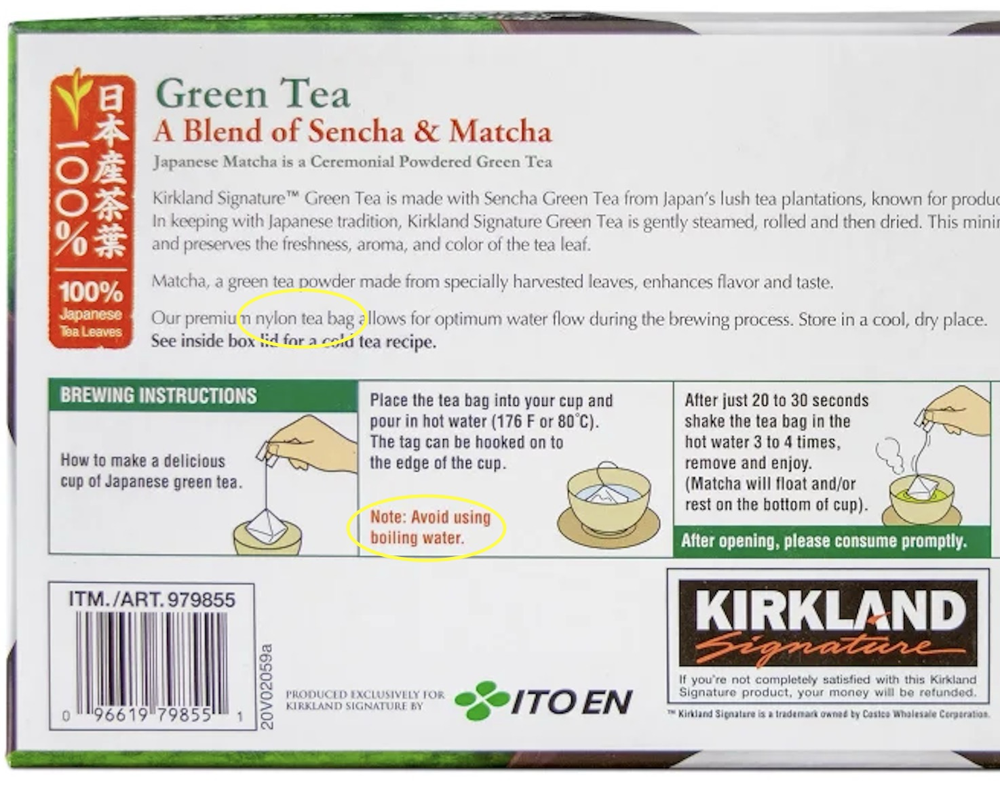

+++
title = 'A little something extra in your tea - microplastics and nanoplastics'
date = 2024-06-30
draft = false
+++

You probably should not drink tea contained in tea bags, unless you are sure you know what they are made of. Once upon a time, tea bags were made of paper. Now, most of them are made of plastic-based materials (polyethylene, nylon).

These tea bags release *billions* of microplastics and *billions* of nanoplastic particles *with each cup of tea made using a tea bag* [^Ali2023]. The effects on humans are not well known, and part of the reason is that there can be no control in studies looking at the effect of microplastics because there is no person on Earth that isn't contaminated, and micro and nanoplastics have been found in every organ in the human body. Brains, penises, gonads, you name it. Disturbing, right?

Before the Ali 2023 study, the best estimates on daily intake of microplastics was around 39000 - 52000 [^Cox2019]. Hilarious underestimate, it seems, if we are getting billions in each individual cup of tea.

 
*Photo by <a href="https://unsplash.com/@belart84?utm_content=creditCopyText&utm_medium=referral&utm_source=unsplash">Artem Beliaikin</a> on <a href="https://unsplash.com/photos/red-and-white-plastic-cup-on-gray-concrete-floor-JsB3j_d4Fnk?utm_content=creditCopyText&utm_medium=referral&utm_source=unsplash">Unsplash</a>*

How much from every sip of water from a plastic cup? A drinking straw? Think your takeout containers are made of paper or cardboard? They probably are coated with plastic for better structure and water/heat retention.

 
*Photo by <a href="https://unsplash.com/@annalouisehill?utm_content=creditCopyText&utm_medium=referral&utm_source=unsplash">Anna Hill</a> on <a href="https://unsplash.com/photos/brown-cardboard-box-on-white-table-OVVsdKrjkEY?utm_content=creditCopyText&utm_medium=referral&utm_source=unsplash">Unsplash</a>*

Grocery meats? Plastic wrapped. Can liners? Plastic lined (most of them got rid of one type of plastic containing BPA and that means they are totally safe, right?)

Even if you live a perfectly plastic-avoidant lifestyle, microplastics are in the drinking water. Of course, bottled water is rife with it [^Qian2024]. You can try filtering it out, but most filters use... plastic parts, including [reverse osmosis filters](https://thehill.com/policy/equilibrium-sustainability/4395725-bottled-water-nanoplastics-potential-health-risks-study/), or are ineffective at removing particles as small as micro and nanoplastics.

> In what the researchers called an ironic finding, they also found plastic compounds in the water that matched the primary material in reverse-osmosis filters — suggesting that the plastics had leached into the water by the very process of filtration, co-author Naixin Qian of Columbia University told The Hill.

Even normally reputable brands like Costco's Kirkland Signature green tea uses nylon teabags. Interestingly (appallingly?), the box goes so far as to suggest that you not use boiling water to make your tea.

*Warning: affiliate links below, from which I may make a small commission at no cost to you. Feel free to search the items independently if you disagree with my use of affiliate links.*

Though I am far from a tea expert, what I have done and recommend checking out are alternative ways to make your teas like tea infusers (which come in [balls](https://amzn.to/3zex0id) or [baskets](https://amzn.to/3RJjlX0)) and using [loose leaf tea](https://amzn.to/4eCO2qu) rather than bagged teas unless you are able to verify there are no plastics in your tea bags.

This post will probably be part of a larger series on microplastics and nanoplastics, so stay tuned.

### References

[^Ali2023]: Ali, T. et al. (2023) ‘Health risks posed by microplastics in tea bags: microplastic pollution – a truly global problem’, International Journal of Surgery (London, England), 109(3), pp. 515–516. Available at: <https://doi.org/10.1097/JS9.0000000000000055>.

[^Qian2024]: Qian, N. et al. (2024) ‘Rapid single-particle chemical imaging of nanoplastics by SRS microscopy’, Proceedings of the National Academy of Sciences of the United States of America, 121(3), p. e2300582121. Available at: <https://doi.org/10.1073/pnas.2300582121>.

[^Cox2019]: Cox, K.D. et al. (2019) ‘Human Consumption of Microplastics’, Environmental Science & Technology, 53(12), pp. 7068–7074. Available at: <https://doi.org/10.1021/acs.est.9b01517>.
